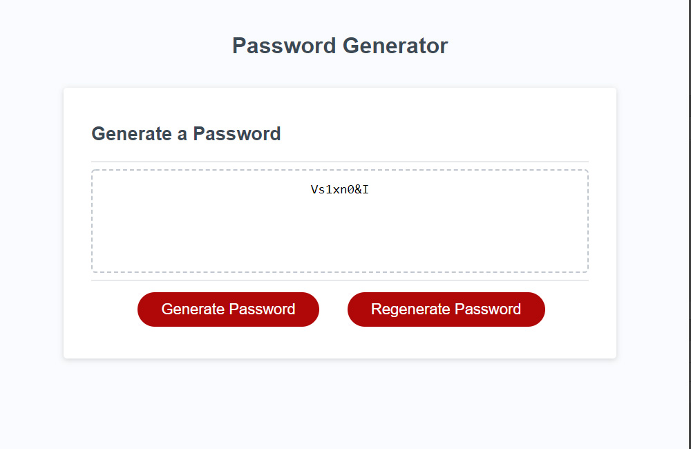

# Password Generator
The password generator asks the user to input how long they want their password to be (8-128 characters, or a random length if they prefer) and whether or not they want lowercase, uppercase, numbers, and/or special characters. Once all prompts are answered, the generator returns a random password. Any mis-answered prompts are redirected to ask again.\
Once the user has submitted the prompts, they are able to re-generate a password (with the same requirements they had previously entered) as many times as they want until they get a password they like. They are able to change the password requirements at any time by running "generate password" again.

# View Live Page
[View the live Password Generator page on GitHub.](https://jcolecodes.github.io/password-generator-challenge-03/)

# Screenshot
